# Paper Trading Simulator

[Download here](https://github.com/mowfreteons181/CryptoBot4Dummies/releases)

> No cap, this script goes hard at simulating token trades—buy when market-cap pops off, hold a minute, sell, and log every move. Get in, get out, get data.

---

## 🚀 TL;DR

* **What it does:** Buys tokens once USD market-cap ≥ `MARKETCAP_THRESHOLD`, holds for `HOLD_DURATION_MIN` minutes, then sells.
* **Modes:**

  * **live**: Fetch real token data from `pump.fun`
  * **mock**: Random-walk prices over your provided token list
* **Logs:** Every buy/sell dumped to `data/trades/all_trades.csv`

---

## 📊 Flowchart

```mermaid
flowchart LR
    A[Start Simulation] --> B[Get Current Prices]
    B --> C{Active Trade?}
    C -- Yes --> D[Check Hold Duration]
    C -- No  --> E[Scan Tokens for Buy]
    D -- Time’s up --> F[Sell Trade & Log]
    D -- Not yet --> G[Skip Sell]
    E -- MC ≥ Threshold --> H[Buy Trade & Log]
    E -- else --> G
    F & H --> I[Update Balance]
    G --> I
    I --> J[Wait 1 minute]
    J --> B
```



---

## 🛠️ Prerequisites

* Python 3.7+
* Install libs:

  ```bash
  pip install pandas requests
  ```

---

## ⚙️ Configuration

Edit the top of the script (`paper_trading_simulator.py`) to tweak:

```python
INITIAL_BALANCE    = 1000.0      # Starting cash
SUPPLY             = 1_000_000_000
MARKETCAP_THRESHOLD= 100_000.0   # USD cap trigger
INVEST_FRACTION    = 0.10        # % of balance per buy
HOLD_DURATION_MIN  = 1           # minutes to hold
FEE_RATE           = 0.002       # 0.2% per trade leg
BASE_URL           = "https://frontend-api-v3.pump.fun"
PAGE_SIZE          = 100
```

---

## 📂 File Structure

```
.
├── paper_trading_simulator.py   # your main script
└── data
    └── trades
        └── all_trades.csv      # logs auto-generated here
```

---

## 🎮 Usage

1. **Save** the code as `paper_trading_simulator.py`.

2. **Run live** mode:

   ```bash
   python paper_trading_simulator.py
   ```

   (default runs 5 minutes; edit `sim.run(total_minutes=…)` under `if __name__…`)

3. **Run mock** mode for testing (pass a token list):

   ```python
   from paper_trading_simulator import PaperTradingSimulator
   sim = PaperTradingSimulator(
       INITIAL_BALANCE,
       mode="mock",
       tokens=["TOKEN1", "TOKEN2", "TOKEN3"]
   )
   sim.run(total_minutes=10)
   ```

---

## 📝 Logging

Every buy/sell appends a row to `data/trades/all_trades.csv` with columns:

```
timestamp, token, action, price,
amount_invested, amount_returned,
gain_loss_usd, gain_loss_pct
```

---

## 🤝 Contributing

Pull requests welcome. Just keep it clean, no drama.

---

## 📜 License

MIT. Do your thing—but don’t sue me.
